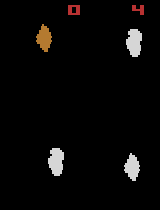
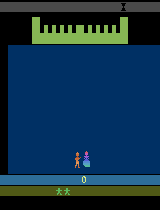
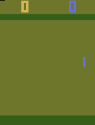
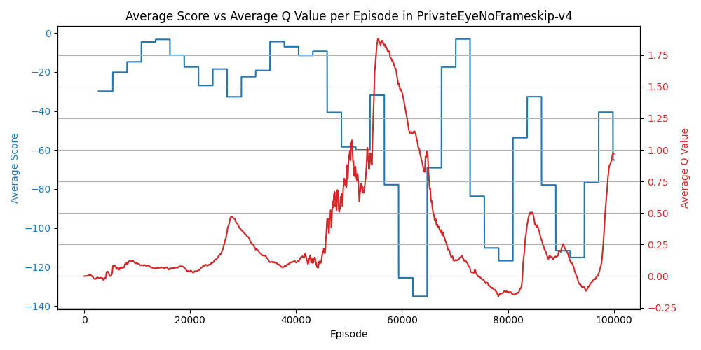

# Dueling DDQN

🚧👷🛑 Under Construction!!!

## Table of Contents

1. [Overview](#overview)
2. [Setup](#setup)
3. [Results](#results)
4. [Analysis](#analysis)

## Overview

This repository contains an implementation of Dueling Double Deep Q-Network (Dueling DDQN) learning using PyTorch.

## Setup

### Required Dependencies

It's recommended to use a Conda environment to manage dependencies and avoid conflicts. You can create and activate a new Conda environment with the following commands:

```bash
conda create -n rl python=3.11
conda activate rl
```

After activating the environment, install the required dependencies using:

```bash
pip install -r requirements.txt
```

### Running the Algorithm

You can run the algorithm on any supported Gymnasium Atari environment with a discrete action space using the following command:

```bash
python main.py --env 'MsPacmanNoFrameskip-v4'
```

#### Command-Line Arguments

- **Environment Selection**: Use `-e` or `--env` to specify the Gymnasium environment. The default is `None`, so you must specify an environment.
  
  Example:

  ```bash
  python main.py --env 'PongNoFrameskip-v4'
  ```

- **Number of Learning Steps**: Use `--n_steps` to define how many training steps the agent should undergo. The default is 1,000,000 steps.

  Example:

  ```bash
  python main.py --env 'BreakoutNoFrameskip-v4' --n_steps 200000
  ```

- **Parallel Environments**: Use `--n_envs` to specify the number of parallel environments to run during training. The default is 32 environments, optimizing the training process.

  Example:

  ```bash
  python main.py --env 'AsterixNoFrameskip-v4' --n_envs 16
  ```

- **Continue Training**: Use `--continue_training` to determine whether to continue training from saved weights. The default is `True`, allowing you to resume training from where you left off.

  Example:

  ```bash
  python main.py --env 'AsteroidsNoFrameskip-v4' --continue_training False
  ```

Using a Conda environment along with these flexible command-line options will help you efficiently manage your dependencies and customize the training process for your specific needs.

## Results

<table>
    <tr>
        <td>
            <p><b>AirRaid</b></p>
            
        </td>
        <td>
            <p><b>Alien</b></p>
            
        </td>
        <td>
            <p><b>Amidar</b></p>
            
        </td>
    </tr>
    <tr>
        <td>
            
        </td>
        <td>
            
        </td>
        <td>
            
        </td>
    </tr>
</table>
<table>
    <tr>
        <td>
            <p><b>Assault</b></p>
            
        </td>
        <td>
            <p><b>Asterix</b></p>
            
        </td>
        <td>
            <p><b>Asteroids</b></p>
            
        </td>
    </tr>
    <tr>
        <td>
            
        </td>
        <td>
            
        </td>
        <td>
            
        </td>
    </tr>
</table>
<table>
    <tr>
        <td>
            <p><b>Atlantis</b></p>
            
        </td>
        <td>
            <p><b>BankHeist</b></p>
            
        </td>
        <td>
            <p><b>BattleZone</b></p>
            
        </td>
    </tr>
    <tr>
        <td>
            
        </td>
        <td>
            
        </td>
        <td>
            
        </td>
    </tr>
</table>
<table>
    <tr>
        <td>
            <p><b>BeamRider</b></p>
            
        </td>
        <td>
            <p><b>Berzerk</b></p>
            
        </td>
        <td>
            <p><b>Bowling</b></p>
            
        </td>
    </tr>
    <tr>
        <td>
            
        </td>
        <td>
            
        </td>
        <td>
            
        </td>
    </tr>
</table>
<table>
    <tr>
        <td>
            <p><b>Boxing</b></p>
            
        </td>
        <td>
            <p><b>Breakout</b></p>
            
        </td>
        <td>
            <p><b>Carnival</b></p>
            
        </td>
    </tr>
    <tr>
        <td>
            
        </td>
        <td>
            
        </td>
        <td>
            
        </td>
    </tr>
</table>
<table>
    <tr>
        <td>
            <p><b>Centipede</b></p>
            
        </td>
        <td>
            <p><b>ChopperCommand</b></p>
            
        </td>
        <td>
            <p><b>CrazyClimber</b></p>
            
        </td>
    </tr>
    <tr>
        <td>
            
        </td>
        <td>
            
        </td>
        <td>
            
        </td>
    </tr>
</table>
<!--<table>
    <tr>
        <td>
            <p><b>Defender</b></p>
            
        </td>
        <td>
            <p><b>DemonAttack</b></p>
            
        </td>
    </tr>
    <tr>
        <td>
            
        </td>
        <td>
            
        </td>
    </tr>
</table>
<table>
    <tr>
        <td>
            <p><b>DoubleDunk</b></p>
            
        </td>
        <td>
            <p><b>ElevatorAction</b></p>
            
        </td>
        <td>
            <p><b>Enduro</b></p>
            
        </td>
    </tr>
    <tr>
        <td>
            
        </td>
        <td>
            
        </td>
        <td>
            
        </td>
    </tr>
</table>
<table>
    <tr>
        <td>
            <p><b>FishingDerby</b></p>
            
        </td>
        <td>
            <p><b>Freeway</b></p>
            
        </td>
        <td>
            <p><b>Frostbite</b></p>
            
        </td>
    </tr>
    <tr>
        <td>
            
        </td>
        <td>
            
        </td>
        <td>
            
        </td>
    </tr>
</table>
<table>
    <tr>
        <td>
            <p><b>Gopher</b></p>
            
        </td>
        <td>
            <p><b>Gravitar</b></p>
            
        </td>
        <td>
            <p><b>Hero</b></p>
            
        </td>
    </tr>
    <tr>
        <td>
            
        </td>
        <td>
            
        </td>
        <td>
            
        </td>
    </tr>
</table>
<table>
    <tr>
        <td>
            <p><b>IceHockey</b></p>
            
        </td>
        <td>
            <p><b>JamesBond</b></p>
            
        </td>
        <td>
            <p><b>JourneyEscape</b></p>
            
        </td>
    </tr>
    <tr>
        <td>
            
        </td>
        <td>
            
        </td>
        <td>
            
        </td>
    </tr>
</table>
<table>
    <tr>
        <td>
            <p><b>Kangaroo</b></p>
            
        </td>
        <td>
            <p><b>Krull</b></p>
            
        </td>
        <td>
            <p><b>KungFuMaster</b></p>
            
        </td>
    </tr>
    <tr>
        <td>
            
        </td>
        <td>
            
        </td>
        <td>
            
        </td>
    </tr>
</table>
<table>
    <tr>
        <td>
            <p><b>MontezumaRevenge</b></p>
            
        </td>
        <td>
            <p><b>MsPacman</b></p>
            
        </td>
        <td>
            <p><b>NameThisGame</b></p>
            
        </td>
    </tr>
    <tr>
        <td>
            
        </td>
        <td>
            
        </td>
        <td>
            
        </td>
    </tr>
</table>
<table>
    <tr>
        <td>
            <p><b>Phoenix</b></p>
            
        </td>
        <td>
            <p><b>Pitfall</b></p>
            
        </td>
        <td>
            <p><b>Pong</b></p>
            
        </td>
    </tr>
    <tr>
        <td>
            
        </td>
        <td>
            
        </td>
        <td>
            
        </td>
    </tr>
</table>
<table>
    <tr>
        <td>
            <p><b>Pooyan</b></p>
            
        </td>
        <td>
            <p><b>PrivateEye</b></p>
            
        </td>
        <td>
            <p><b>Qbert</b></p>
            
        </td>
    </tr>
    <tr>
        <td>
            
        </td>
        <td>
            
        </td>
        <td>
            
        </td>
    </tr>
</table>
<table>
    <tr>
        <td>
            <p><b>Riverraid</b></p>
            
        </td>
        <td>
            <p><b>RoadRunner</b></p>
            
        </td>
        <td>
            <p><b>Robotank</b></p>
            
        </td>
    </tr>
    <tr>
        <td>
            
        </td>
        <td>
            
        </td>
        <td>
            
        </td>
    </tr>
</table>
<table>
    <tr>
        <td>
            <p><b>Seaquest</b></p>
            
        </td>
        <td>
            <p><b>Skiing</b></p>
            
        </td>
        <td>
            <p><b>Solaris</b></p>
            
        </td>
    </tr>
    <tr>
        <td>
            
        </td>
        <td>
            
        </td>
        <td>
            
        </td>
    </tr>
</table>
<table>
    <tr>
        <td>
            <p><b>SpaceInvaders</b></p>
            
        </td>
        <td>
            <p><b>StarGunner</b></p>
            
        </td>
        <td>
            <p><b>Tennis</b></p>
            
        </td>
    </tr>
    <tr>
        <td>
            
        </td>
        <td>
            
        </td>
        <td>
            
        </td>
    </tr>
</table>
<table>
    <tr>
        <td>
            <p><b>TimePilot</b></p>
            
        </td>
        <td>
            <p><b>Tutankham</b></p>
            
        </td>
        <td>
            <p><b>UpNDown</b></p>
            
        </td>
    </tr>
    <tr>
        <td>
            
        </td>
        <td>
            
        </td>
        <td>
            
        </td>
    </tr>
</table>
<table>
    <tr>
        <td>
            <p><b>Venture</b></p>
            
        </td>
        <td>
            <p><b>VideoPinball</b></p>
            
        </td>
        <td>
            <p><b>WizardOfWor</b></p>
            
        </td>
    </tr>
    <tr>
        <td>
            
        </td>
        <td>
            
        </td>
        <td>
            
        </td>
    </tr>
</table>
<table>
    <tr>
        <td>
            <p><b>YarsRevenge</b></p>
            
        </td>
        <td>
            <p><b>Zaxxon</b></p>
            
        </td>
    </tr>
    <tr>
        <td>
            
        </td>
        <td>
            
        </td>
    </tr>
</table>-->

## Analysis

## Acknowledgements

Special thanks to Phil Tabor, an excellent teacher! I highly recommend his [Youtube channel](https://www.youtube.com/machinelearningwithphil).
